# blogpost

Mobile application for blogging

## stack
* dart
* flutter
* bloc (state)
* get_it (dependency injection)
* local_auth (biometric entry)
* firebase/core/auth/firestore/storage/messaging (data layer and notifications)
* image_picker (upload image)
* uuid (for uniqueness in storage)

## architectures
* core (common components for the entire application)
* modules (main functional parts)
  + auth
  + entry
  + notification
  + post
  + user
 
## preview
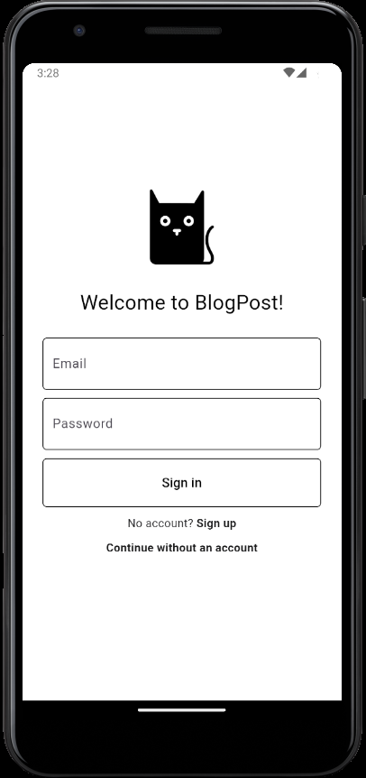
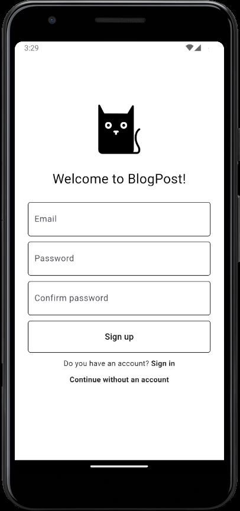
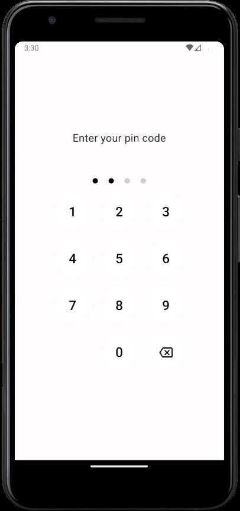
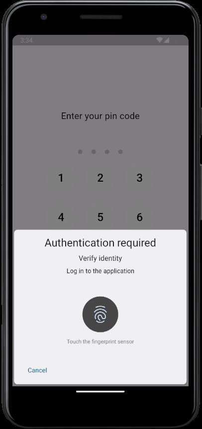
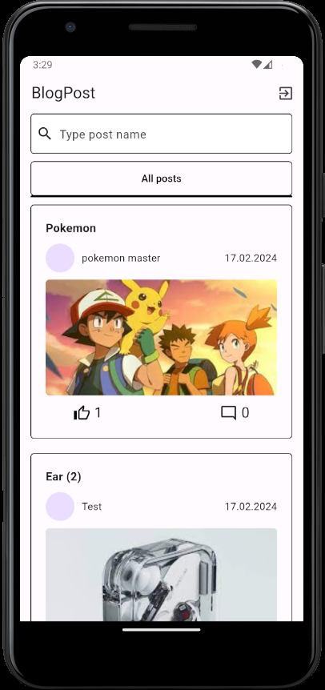
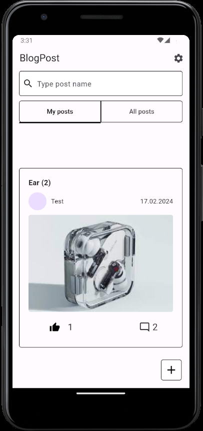
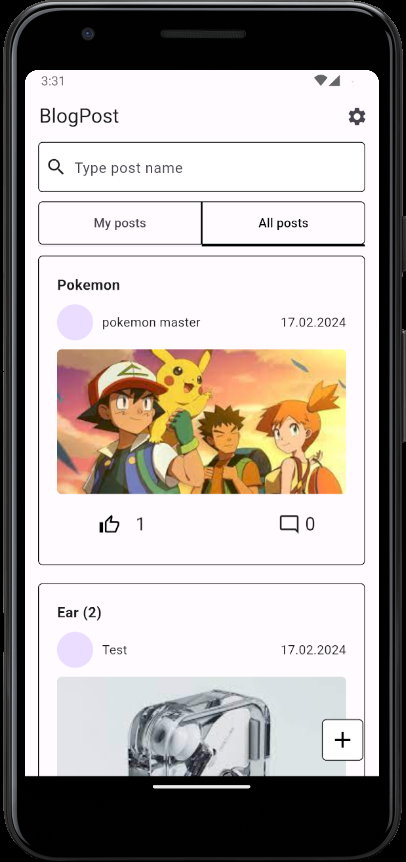
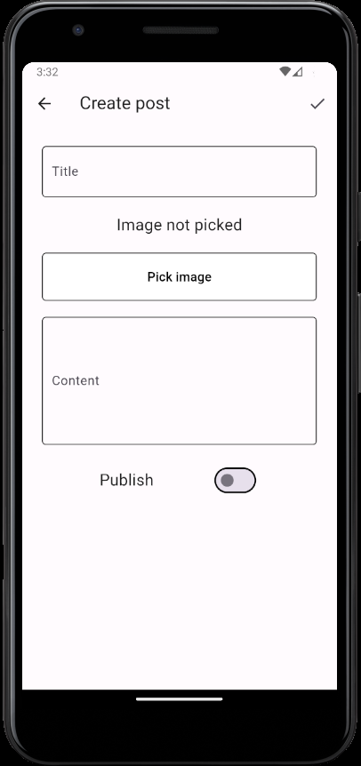
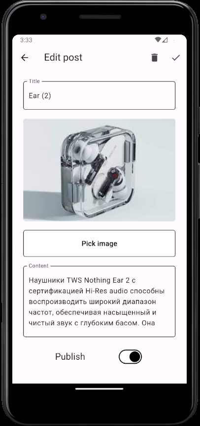
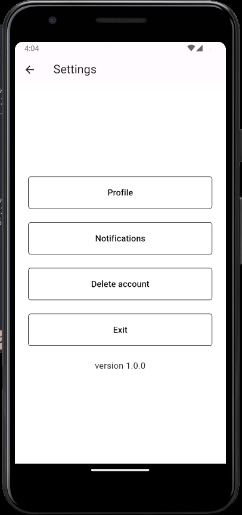
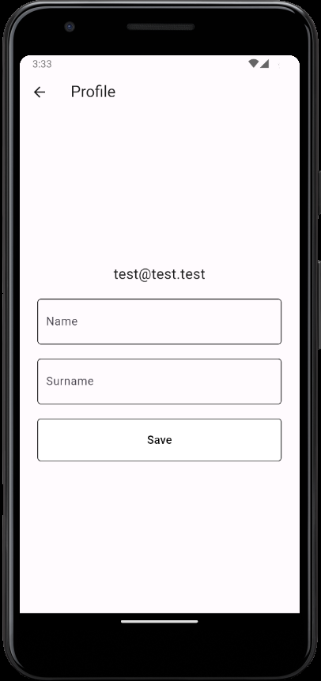
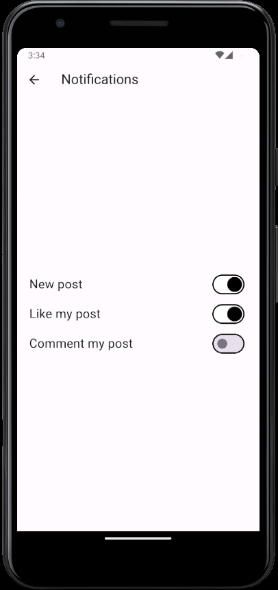
